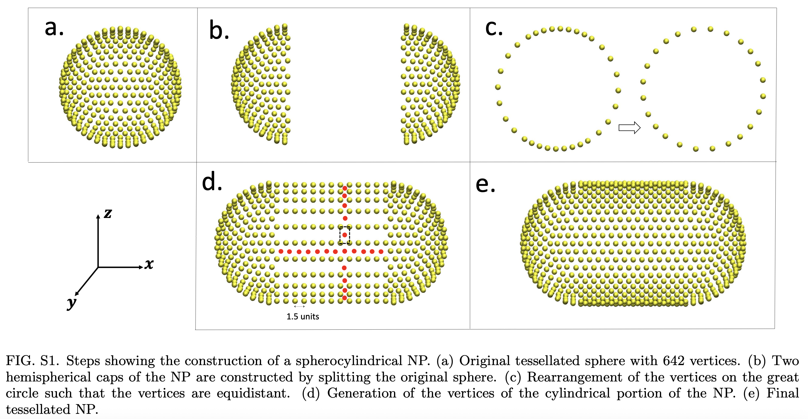

# Spherocylindrical-Nanoparticle
This code generates a Spherocylindrical NP of Radius,R and Aspect Ratio, AR. \
In order to generate the vertices, compile the  SCNP.cpp. The executable file requires the desired radius and Aspect Ratio of the NP. 

# Code Schematics

# Usage
SCNP is a executable file which can be executed as: \
./SCNP.out radius AR

# Output
Once the code is run, it outputs a .xyz file, containing the vertices of the NP.

# Disclaimer

If you use this code anywhere, I want to kindly request you to cite the following the articles as an acknowledgement,

https://pubs.acs.org/doi/full/10.1021/acsnano.4c01099

https://pubs.aip.org/aip/jcp/article/156/23/234901/2841428/Modes-of-adhesion-of-spherocylindrical

https://pubs.rsc.org/en/content/articlelanding/2023/sm/d2sm01574a
